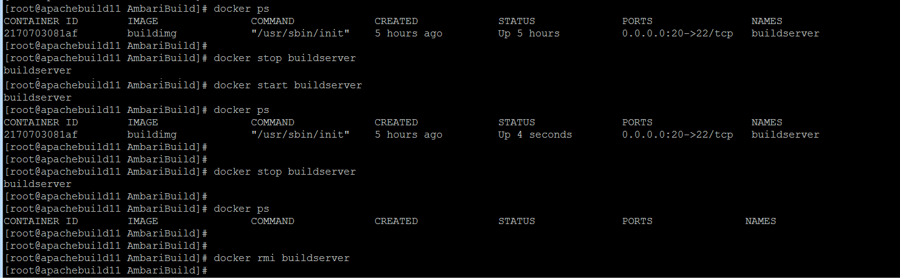

# Docker Apache Ambari Builder

This repo setup the Apache Ambari source code in a docker container and build the Apache Ambari code. 

The docker container will install JDK 7, Apache Maven, Python 2.6, Python setuptools, Apache ANT, rpmbuild & g++

The docker container download the Apache Ambari 2.6.1 from http://www.apache.org/dist/ambari/ambari-2.6.1/apache-ambari-2.6.1-src.tar.gz and setup the Ambari code in /opt/Ambari/build/apache-ambari-2.6.1-src

Most of the Apache project have same build environment so you can use the same container for build other Apache Projects.
    

## Usage

 

    1) Run the ./setupDocker.sh script to setup Docker in Linux
       
       ./setupDocker.sh
       

 

     2) Run the ./build.sh to setup Docker Container and build the Ambari Code. Build takes more than an hour to 
        download and build the code.
     
        ./build.sh
        

         

        
        
        After completing the build the Ambari rpm will be availabe under generatedRPM folder or in the docker container 
        path /opt/Ambari/build/apache-ambari-2.6.1-src 
        
        The password for login to docker container is "passw0rd"
        

 

 

  
     3) If the user wants to build the modified the code, the user can modify the files under /opt/Ambari/build/
        apache-ambari-2.6.1-src and run the /opt/Ambari/setupAmbari.sh to build the Amabri code. For building 
        the LogSearch, run /opt/Ambari/setupLogSearch.sh from the docker container.
    
 
 

      4) Basic docker commands to stop/start/remove the docker container
      

  
        
        
        
## Author

**Nisanth Simon** - [NisanthSimon@LinkedIn]

[NisanthSimon@LinkedIn]: https://au.linkedin.com/in/nisanth-simon-03b2149
 
 
        
        
    
